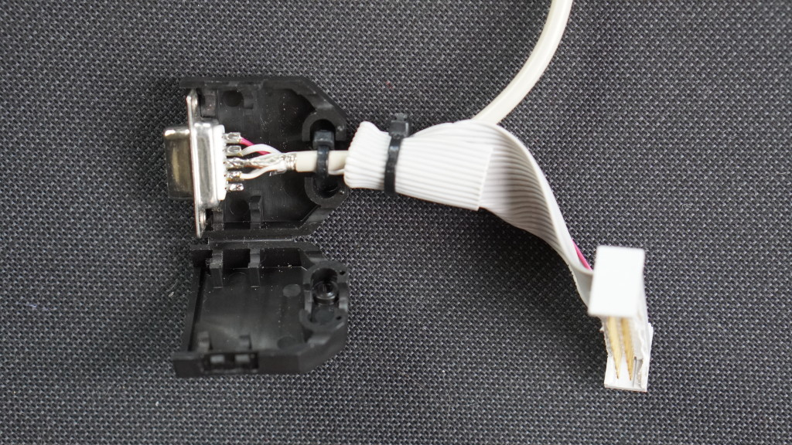
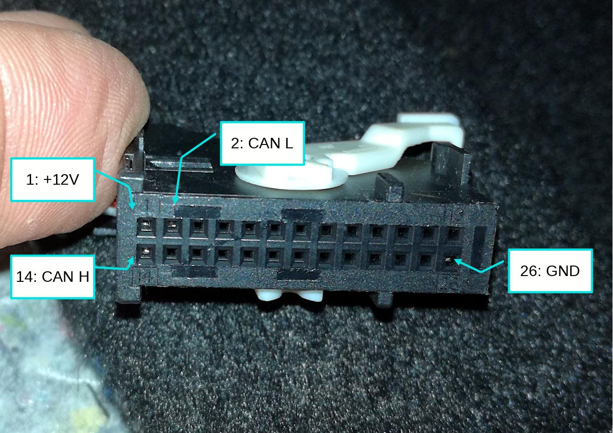
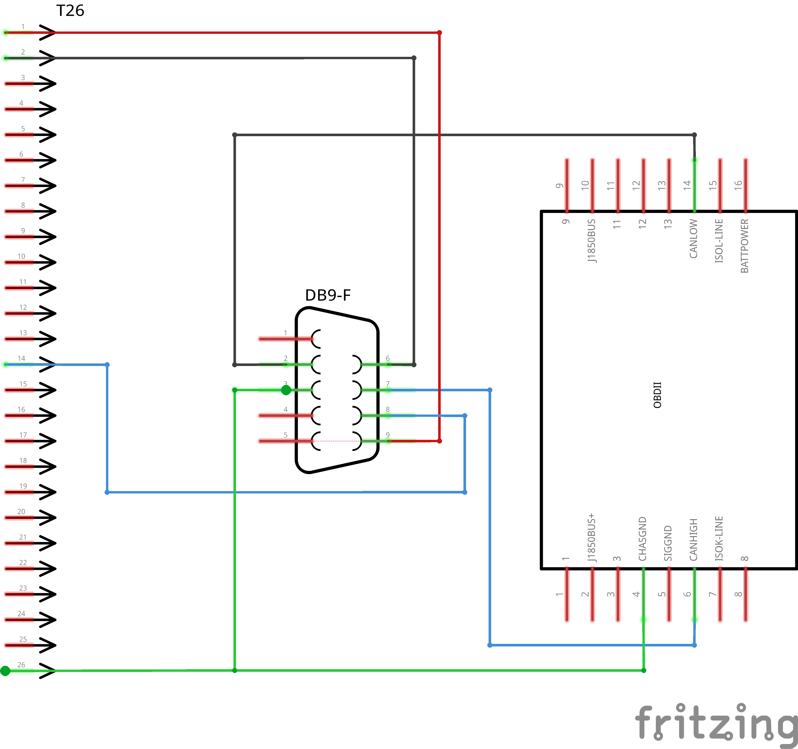
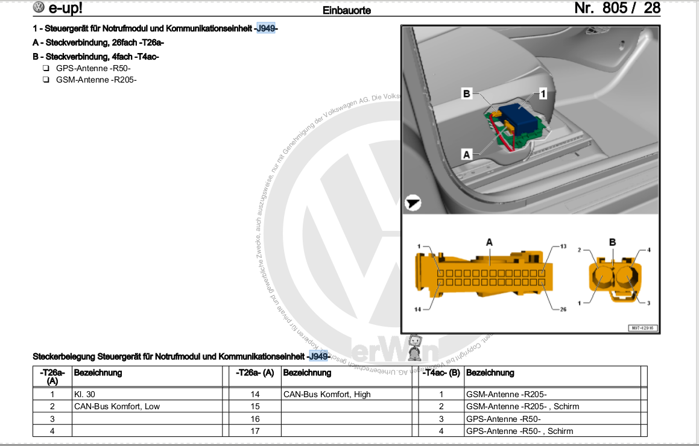
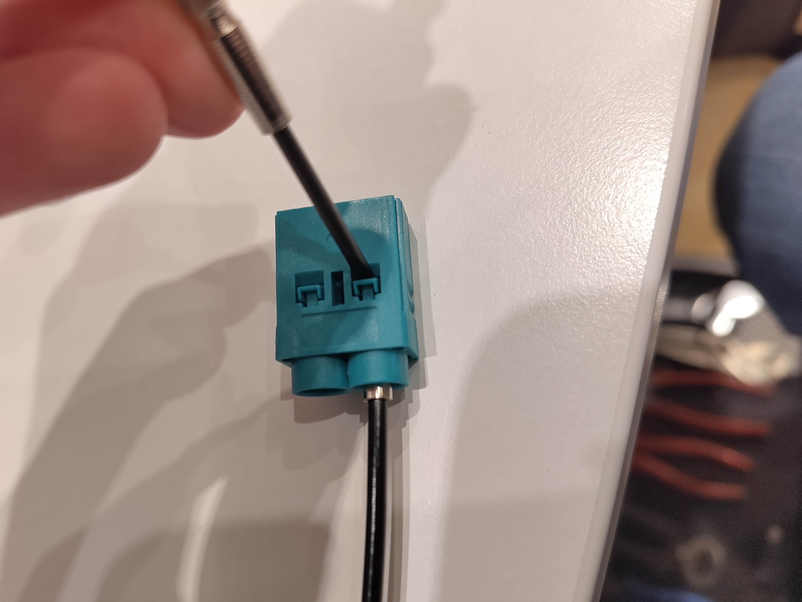
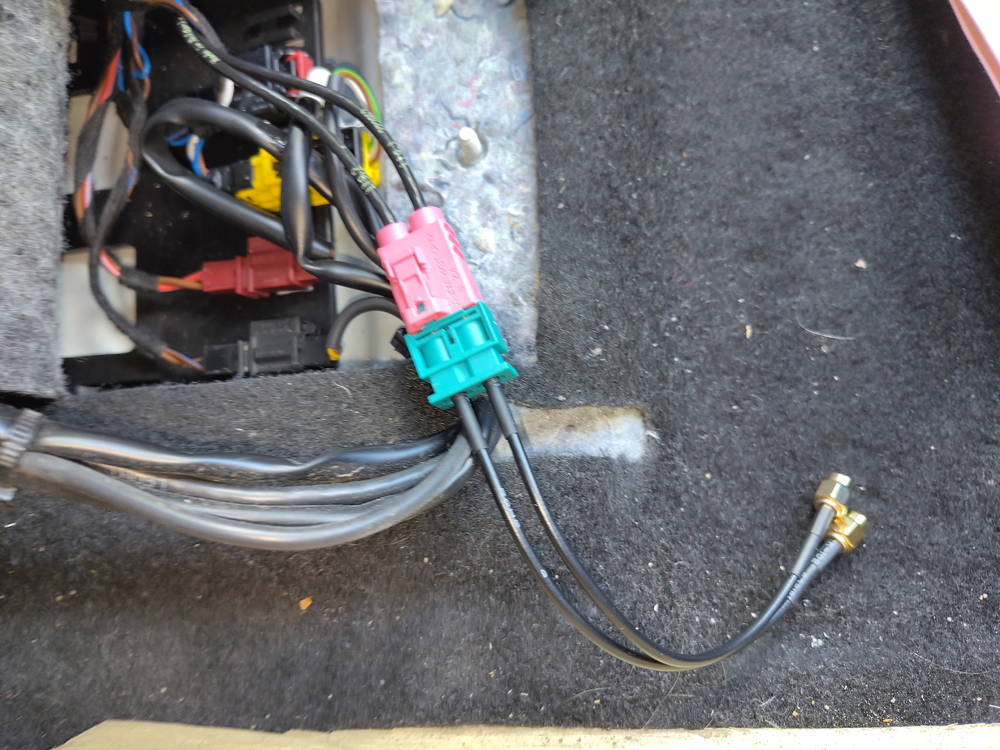

# VW e-Up! 2021 OVMS install experience report

> [!CAUTION]
>
> Disclaimer:
>
> **This document is provided for educational and informational purposes only.**
>
> The information contained herein represents personal experience and should not be considered professional advice.
>
> **By using this information, you acknowledge and agree that:**
>
> - You assume all risks and responsibilities for any modifications to your vehicle
> - Any work performed on your vehicle is done at your own risk
> - The author(s) disclaim all liability for any damage, injury, or loss that may result from following these instructions
> - Vehicle modifications may void warranties, affect safety systems, or violate local regulations
> - You should consult qualified professionals before performing any vehicle modifications
> - This information is provided "as is" without any warranties, express or implied
>
> **Proceed only if you have the necessary skills, tools, and understanding of automotive electrical systems.**

Based on <https://docs.openvehicles.com/en/latest/components/vehicle_vweup/docs/#variant-1>

Connecting to the Comfort CAN using the OCU T26A connector

You need to establish a connection between the OBD2 and the OCU ports. If installing the OVMS near the OBD2 port, you need to make a cable to connect to the T26A plug (or tap into the T26A cable there). If installing the OVMS replacing the OCU, you need to connect the OBD2 CAN bus from there.

|     | Parts used by us                                                                                                                                                                                                                                                                       |
| --- | -------------------------------------------------------------------------------------------------------------------------------------------------------------------------------------------------------------------------------------------------------------------------------------- |
| 1x  | [Open Vehicle Monitoring System W-LAN version](https://shop.openenergymonitor.com/) open-vehicle-monitoring-system-ovms-wifi-4g-sim-ant-included/                                                                                                                                      |
| 1x  | [26 Pin ribbon cable](https://www.amazon.de/dp/B07SXH1KFG) currently held by zip ties at  the OVMS   we are planning to replace it with a [26 Pin Male ECU Automotive Connector](https://www.amazon.de/dp/B0DW9FKYWR) and a twisted pair cable if it ever breaks/looses connection |
| 1x  | [OBD2 16-Pin Connector](https://www.amazon.de/dp/B0BZNMZVC4)                                                                                                                                                                                                                           |
| 1x  | DB9-F male adapter                                                                                                                                                                                                                                                                     |
| 2x  | [Fakra Z male to SMA female Antenna Adapter](https://www.amazon.de/dp/B0DNYVKY4N)                                                                                                                                                                                                      |
| 1x  | [Double Fakra Female Antenna Adapter](https://www.amazon.de/dp/B075QGFDTL)                                                                                                                                                                                                             |

## Soldering DIY Cable

An adapter cable has to be made with the following connections:

Image: OVMS-OBD2-T26A-Cable.jpg

The cable used between the OBD plug and the DB9-F plug needs to be twisted to avoid transmission problems. A good cable to use here is a CAT-5 or CAT-6 double shielded network cable. Be sure to connect **CAN hi** and **CAN lo** AND **Ground**.

> [!NOTE]
> the VW T26a pin numbering scheme does not follow the IT standard (zig zag) but instead has pins 1-13 left to right on the top and 14-26 left to right on the bottom row. See image above.

Image: T26a-Pins.jpg

| T26 | DB9-F | OBD | Signal                    |
| --- | ----- | --- | ------------------------- |
| 26  | 3     | 4   | Chassis / Power GND       |
| -   | 2     | 14  | can1 L (OBD2 CAN Low)     |
| -   | 7     | 6   | can1 H (OBD2 CAN High)    |
| -   | 4     | -   | can2 L (not used)         |
| -   | 5     | -   | can2 H (not used)         |
| 2   | 6     | -   | can3 L (Comfort-CAN Low)  |
| 14  | 8     | -   | can3 H (Comfort-CAN High) |
| 1   | 9     | -   | +12V Vehicle Power        |

Image: OVMS-OBD2-T26A-Cable_Schematic.svg

## GPS and GSM (LTE) adapter

We were unable to find a prebuilt Fakra Z double male to 2x SMA female antenna adapter. To address this, we purchased two [Fakra Z male to 2x SMA female antenna adapters](https://www.amazon.de/dp/B0DNYVKY4N) and one [double Fakra female antenna adapter](https://www.amazon.de/dp/B075QGFDTL). Using parts from these, we assembled a custom solution.

Image: Schematic view of the T26a and SMA Connector at the OCU

> [!WARNING]
> Pluging the GSM-Antenna in the GPS-Port of the OVMS and vice versa, can cause damages. Double check before pluging in the OVMS and enabling the Cellular Modem.

Image: Fakra Z Adapter open securing pin

To take the cables out of the Fakra Z Adapters, we removed the lila plastic from the adapter, gently pushed up the securing pin on the back with a small screwdriver and pulled the respective cable gently out.
Then we just pushed the SMA antenna cables in the double male Fakra Z Connector. We weren't able to reinsert the lila plastic into the Connector, because the SMA adapter Cable had different slots that the original cable, but the securing pins were strong enough to keep the cables in place.

Image: double male Fakra Z to 2x SMA Adapter

